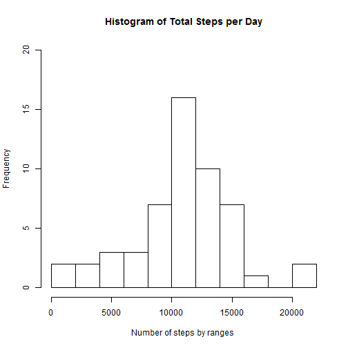
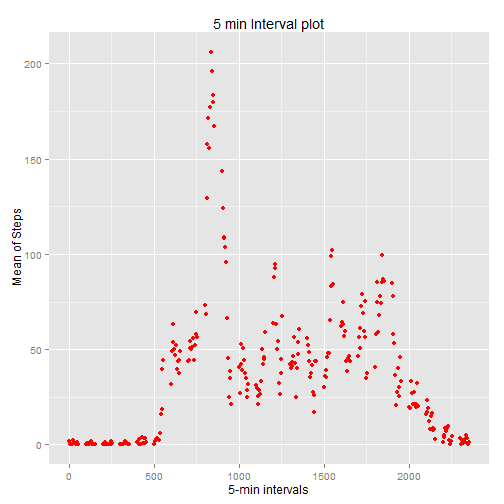
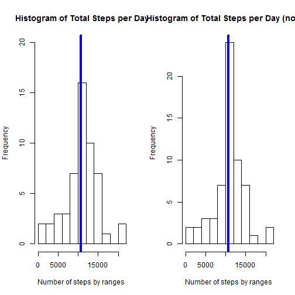
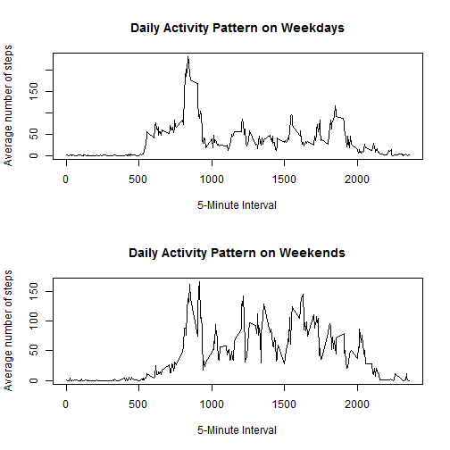

setwd("C:/RR/C5")

[My github page](https://github.com/dainova/RepData_PeerAssessment1)

<br><br>  


&nbsp;&nbsp;&nbsp;&nbsp;
First let's load Libs and Prepare data. Produced dataset **_actSumm_** will display total number of steps taken per day. NA values ommited.


```r
library (plyr)
library(ggplot2)

act <- read.csv ('activity.csv')             ## Factors blocked for now
actNA  <- na.omit(act)
actSumm <- ddply (actNA,.(date), summarize, stepSum=sum (steps))
head(actSumm)
```

```
##         date stepSum
## 1 10/10/2012    9900
## 2 10/11/2012   10304
## 3 10/12/2012   17382
## 4 10/13/2012   12426
## 5 10/14/2012   15098
## 6 10/15/2012   10139
```
<br><br>  

&nbsp;&nbsp;&nbsp;&nbsp;
Let's display  structure of produced summary file with `str(actSumm)` for futher reference and cross checking:


```
## 'data.frame':	53 obs. of  2 variables:
##  $ date   : Factor w/ 61 levels "10/1/2012","10/10/2012",..: 2 3 4 5 6 7 8 9 10 11 ...
##  $ stepSum: int  9900 10304 17382 12426 15098 10139 15084 13452 10056 11829 ...
```
<br><br>  


&nbsp;&nbsp;&nbsp;&nbsp;
Let's produce histogram of the total number of steps taken each day:


```r
hist (actSumm$stepSum, 12, main = "Histogram of Total Steps per Day", xlab = "Number of steps by ranges ",ylim=c(0,20))
```
 

&nbsp;&nbsp;&nbsp;&nbsp;
Mean of total number of steps taken per day `mean(actSumm$stepSum)`:

```
## [1] 10766.19
```

&nbsp;&nbsp;&nbsp;&nbsp;
And median `median(actSumm$stepSum)`:

```
## [1] 10765
```


*What is the average daily activity pattern?
<br><br>

&nbsp;&nbsp;&nbsp;&nbsp;
Display  average daily activity pattern using time series plot of 5-min interval and average number of steps :


```r
actAvg <- aggregate(actNA$steps, list(interval = as.numeric(as.character(actNA$interval))), FUN = "mean")
names(actAvg)[2] <- "stepMean"

ggplot(actAvg, aes(interval, stepMean)) + geom_point(color = "Red" ) + labs(title = "5 min Interval plot", x = "5-min intervals", y = " Mean of Steps")
```
 

<br><br>
&nbsp;&nbsp;&nbsp;&nbsp;


Find interval with max  number of steps:


```r
actAvg[actAvg$stepMean == max(actAvg$stepMean), ]
```

```
##     interval stepMean
## 104      835 206.1698
```
<br><br>
&nbsp;&nbsp;&nbsp;&nbsp;


Find how many NA valus we have in dataset:

```r
colMeans(is.na(act))   ## Percentage NA for each of column
```

```
##     steps      date  interval 
## 0.1311475 0.0000000 0.0000000
```

```r
sum(is.na(act$steps))  ## Number of NA values 
```

```
## [1] 2304
```
NA only present in steps column

<br><br>&nbsp;&nbsp;&nbsp;&nbsp;
We replace NA values in original dataset with mean value for given interval for more realistic picture:

```r
actNew <- act 
for (i in 1:nrow(actNew)) {
    if (is.na(actNew$steps[i])) {
        actNew$steps[i] <- actAvg[which(actNew$interval[i] == actAvg$interval), ]$stepMean
    }
}
```
<br><br>&nbsp;&nbsp;&nbsp;&nbsp;


Now we can observe that NA were replaced with mean values and make sure we don't have NA values in new dataset:

```r
head(act,3)      ##before
```

```
##   steps      date interval
## 1    NA 10/1/2012        0
## 2    NA 10/1/2012        5
## 3    NA 10/1/2012       10
```

```r
head(actNew,3)   ##after
```

```
##       steps      date interval
## 1 1.7169811 10/1/2012        0
## 2 0.3396226 10/1/2012        5
## 3 0.1320755 10/1/2012       10
```

```r
colMeans(is.na(actNew))   ## Percentage NA for each of column
```

```
##    steps     date interval 
##        0        0        0
```
<br><br>&nbsp;&nbsp;&nbsp;&nbsp;


New histogram of the total number of steps taken each day and Calculate and report the mean and median total number of steps taken per day. 

```r
actSummNew <- ddply (actNew,.(date), summarize, stepSum=sum (steps))
head(actSummNew)
```

```
##         date  stepSum
## 1  10/1/2012 10766.19
## 2 10/10/2012  9900.00
## 3 10/11/2012 10304.00
## 4 10/12/2012 17382.00
## 5 10/13/2012 12426.00
## 6 10/14/2012 15098.00
```

```r
head(actNew)
```

```
##       steps      date interval
## 1 1.7169811 10/1/2012        0
## 2 0.3396226 10/1/2012        5
## 3 0.1320755 10/1/2012       10
## 4 0.1509434 10/1/2012       15
## 5 0.0754717 10/1/2012       20
## 6 2.0943396 10/1/2012       25
```


```r
opar=par(ps=12) 
par(mfrow=c(1,2))
hist (actSumm$stepSum, 12, main = "Histogram of Total Steps per Day", xlab = "Number of steps by ranges ",ylim=c(0,20))
abline(v = median(actSumm$stepSum), col = 4, lwd = 4)

hist (actSummNew$stepSum, 12, main = "Histogram of Total Steps per Day (no NA)", xlab = "Number of steps by ranges ")
abline(v = median(actSummNew$stepSum), col = 4, lwd = 4)
```
 

<br><br>&nbsp;&nbsp;&nbsp;&nbsp;

Lets calculate new mean and median:

```r
mean(actSummNew$stepSum)
```

```
## [1] 10766.19
```


```r
median(actSummNew$stepSum)
```

```
## [1] 10766.19
```
<br><br>&nbsp;&nbsp;&nbsp;&nbsp;


Comparing values we can determine that difference is minimal so our approach replacing missing values worked OK.


####################################################################################
<br><br>&nbsp;&nbsp;&nbsp;&nbsp;

To research differences in activity patterns between weekdays and weekends we introduce new factor column _wday_:


```r
#str(actNew)
#head(actNew)
#colMeans(is.na(actNew)) 

actNew$date <-as.Date(actNew$date,format="%m/%d/%Y")
actNew$wday <- weekdays(as.Date(actNew$date,format="%m/%d/%Y"))
actNew$wday <- ifelse((actNew$wday == "Sunday" | actNew$wday == "Saturday") ,"weekend", "weekday")
actNew$wday <- as.factor(actNew$wday)
```

Then we create 2 new dataset for weekend and weekdays and build plots:

```r
actNewDay <- subset(actNew, wday == "weekday") 
actNewWnd <- subset(actNew, wday == "weekend") 

#head(actNewWnd,30)


actNewWnd.Mean<-tapply(actNewWnd$steps, actNewWnd$interval, mean)
actNewDay.Mean<-tapply(actNewDay$steps, actNewDay$interval, mean)
par(mfrow=c(2,1))
plot(y = actNewDay.Mean, x = names(actNewDay.Mean), type = "l", xlab = "5-Minute Interval", 
     main = "Daily Activity Pattern on Weekdays", ylab = "Average number of steps")
plot(y = actNewWnd.Mean, x = names(actNewWnd.Mean), type = "l", xlab = "5-Minute Interval", 
     main = "Daily Activity Pattern on Weekends", ylab = "Average number of steps", )
```

 

<br><br>&nbsp;&nbsp;&nbsp;&nbsp;
From those plot we can see that distribution is different for weekend and weekdays.


